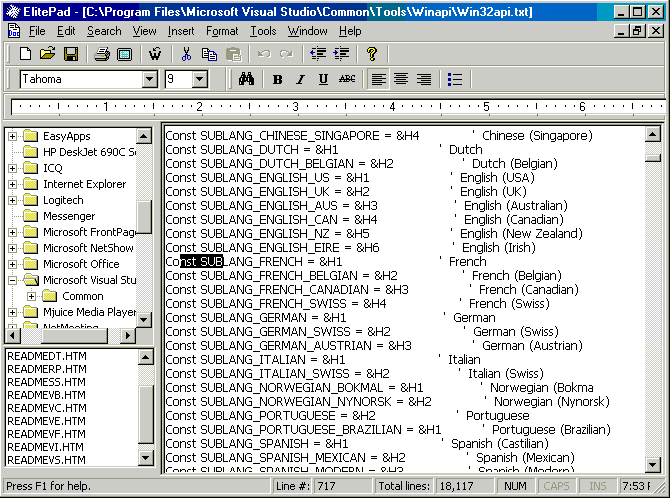



## ElitePad

### Description

ElitePad is complete Text Editor. It has all standard and advanced functions needed by Text Editor. It has more functions than Windows WordPad.

Functions that ElitePad now have:

1. It is fully commented so that beginners can learn

2. Opening and saving files with formatting (RTF Format)

3. Powerful find and replace function

4. Faster loading of fonts with EnumFonts API

5. Go to function (to go to specified line number)

6. Custom MsgBox

7. View Document Properties

8. Menu Highlight Help

9. File Tree for viewing files like Explorer and opening them

10. Multi select open dialog

11. Insert Picture, Time and Date and Text file

12. Copy, Rename and Move files

13. Insert ANSI symbols

14. Access to registry

15. Stay on top function

16. HTML Help

17. OLE Drag & Drop

18. Line counting

19. Associate files with ElitePad

20. And many, many more.

P.S

PLEASE VOTE FOR ME!!!
 
### More Info
 

             |
---                |---
**Submitted On**   |2000-12-03 19:24:02
**By**             |[Andrea Batina\[Revelatek\]](https://github.com/Planet-Source-Code/PSCIndex/blob/master/ByAuthor/andrea-batina-revelatek.md)
**Level**          |Advanced
**User Rating**    |4.8 (367 globes from 76 users)
**Compatibility**  |VB 4\.0 \(32\-bit\), VB 5\.0, VB 6\.0
**Category**       |[Complete Applications](https://github.com/Planet-Source-Code/PSCIndex/blob/master/ByCategory/complete-applications__1-27.md)
**World**          |[Visual Basic](https://github.com/Planet-Source-Code/PSCIndex/blob/master/ByWorld/visual-basic.md)
**Archive File**   |[CODE\_UPLOAD122951232000\.zip](https://github.com/Planet-Source-Code/andrea-batina-revelatek-elitepad__1-13291/archive/master.zip)

